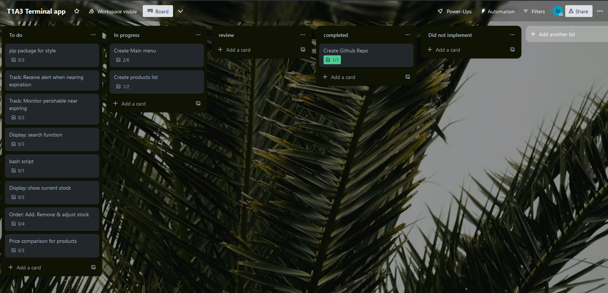
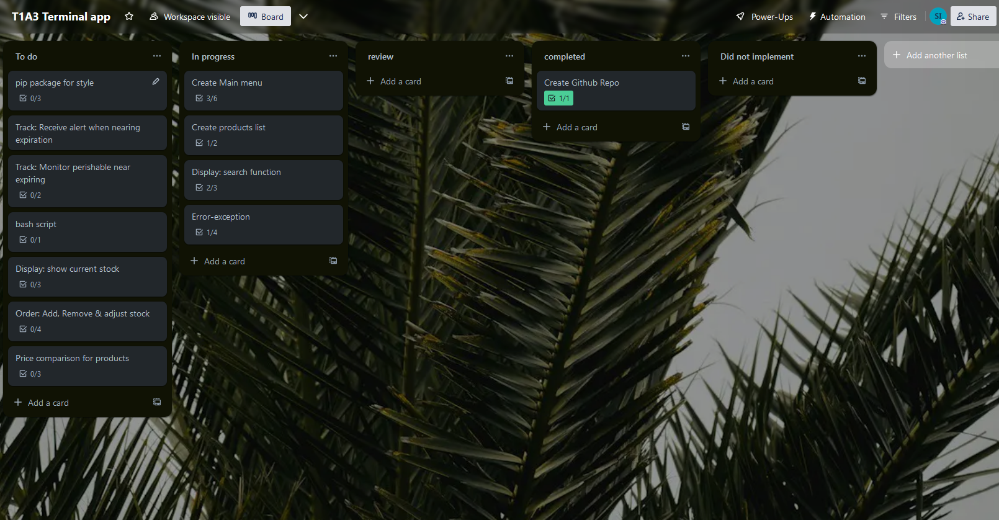
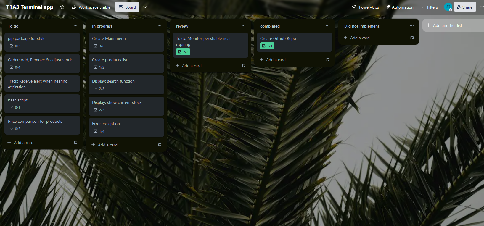
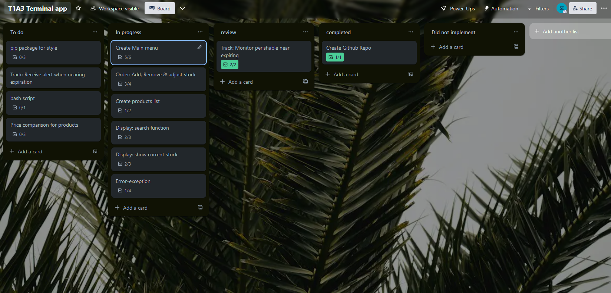
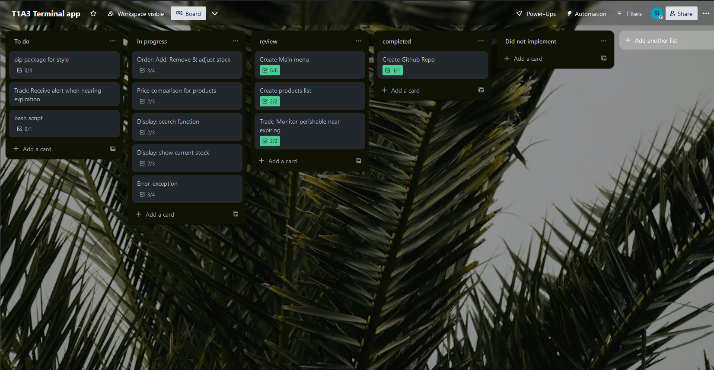
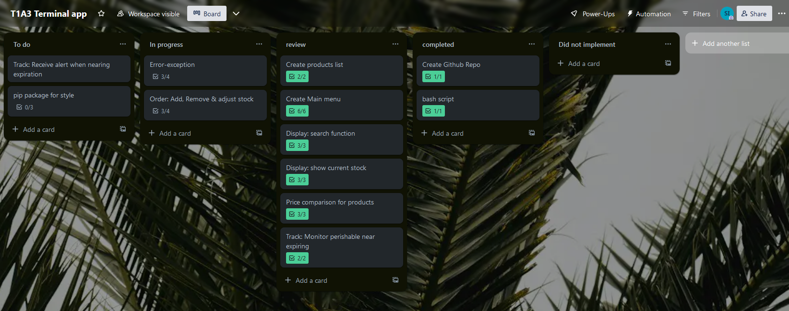
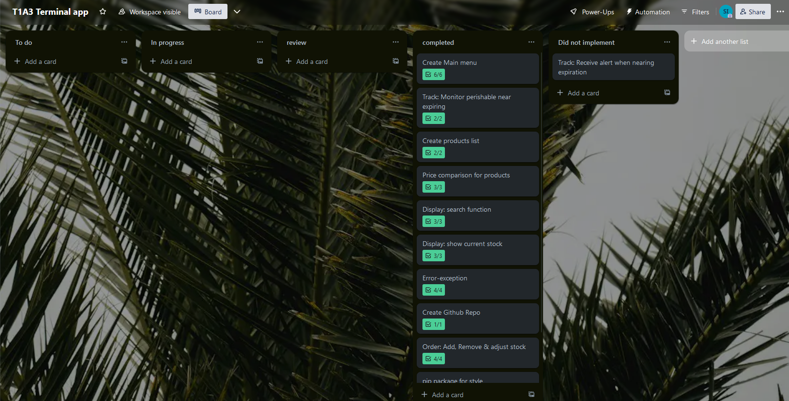
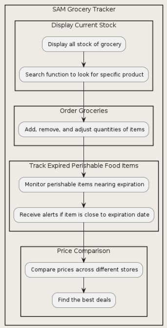
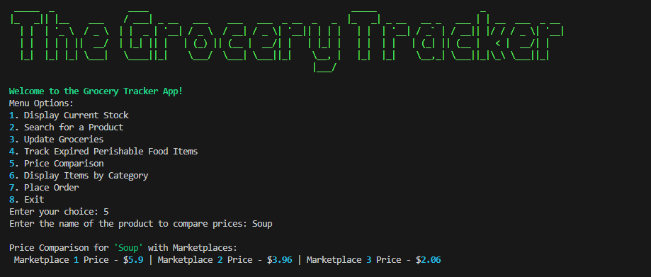
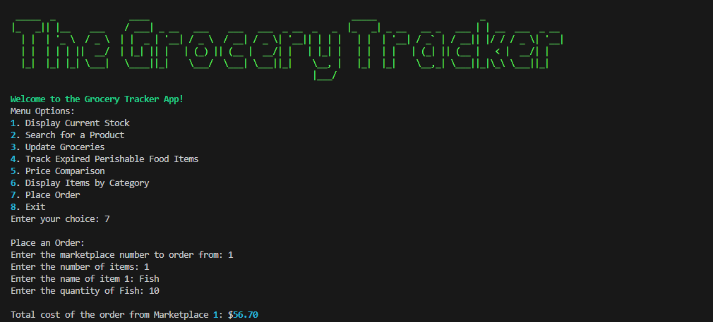

# SkSamirulIslam_T1A3

# Python Grocery Tacker
This application has been created to support tracking of your groceries. Below we will go through an overview of the features this application offers.

## Link to github
https://github.com/Sam559I/SkSamirulIslam_T1A3

## Code Style Guide
Coding style follows PEP8 follow link for further details  
https://peps.python.org/pep-0008/

## Trello 
Day 1

Day 2

Day 3

Day 4

Day 5

Day 6

Day 7

## Map


## Features

### Main Menu
The main menu has a list of options with a Header feature

#### Display Current stock
The "display" function provides users with a comprehensive overview of the current stock inventory. Upon invoking this function, the system will present the user with a structured display comprising four key details for each product:

1. Name of Product: This denotes the unique identifier or name assigned to each item within the inventory.
2. Category: Indicates the specific category or classification to which the product belongs, facilitating organized management and navigation.
3. Quantity: Reflects the current available quantity or stock level for the respective product.
4. Price per Unit: Specifies the cost associated with each unit of the product, aiding users in pricing and financial analysis.


### Search for a Product
This function allows you to search for specific products which display as above __Name__, __Category__, __Quantity__ & __Price__


### Update Groceries
This function allow users to update their groceries by adding and removing


### Track Expired perishable food items
This tool empowers users to effectively monitor perishable food items or products nearing their expiration date. By leveraging this functionality, individuals can proactively manage their inventory, ensuring the timely consumption or disposal of items to prevent spoilage and minimize waste. Specifically designed to track products within a 30-day window prior to their expiration date, the tool serves as a reliable companion for maintaining product freshness and optimizing resource utilization.


### Price Comparison
This function allows users to compare products price points against three tracked market-places with different price points. This function is useful to those who are interested in catching the best prices available.
Key Features:

1. Multi-Marketplace Comparison: Allows users to compare prices across three platforms, aiding informed decision-making.
2. Dynamic Pricing Insights: Provides real-time pricing data, helping users identify cost-effective options.
3. Customizable Preferences: Users can tailor search to array of products in between three platforms


### Display by category
This dynamic feature allows users to display products (in current inventory) via different categories. This allow users to ability to reduce the amount of time spent going through the inventory specific products.

Key Features:

1. Category-based Product Display: Users can organize and view products based on predefined categories, such as electronics, clothing, or groceries.
2. Efficient Inventory Navigation: By grouping similar products under relevant categories, users can quickly locate items of interest, minimizing search time.
3. Enhanced User Efficiency: The feature promotes productivity by allowing users to focus their attention on specific product categories rather than sifting through the entire inventory.


### Place Order
This function streamlines the ordering process for users by enabling them to place orders across three distinct marketplaces, each offering products within different price ranges. Users can initiate multiple orders, selecting various products and quantities from the available inventory. This flexibility empowers users to cater to diverse needs and preferences, facilitating seamless transactions across multiple platforms. 

By accommodating different price ranges and supporting orders with varying product selections and quantities, the function enhances user convenience and ensures a tailored shopping experience.



## Bin Bash 

```
# !/bin/bash

# Check if Python 3 is installed

sh
if command -v python3 &>/dev/null; then
    python3_version=$(python3 --version 2>&1)
    if [[ $python3_version == *"Python 3"* ]]; then
        echo "Python 3 is installed and the default version."

        # Install rich package
        echo "Installing rich package..."
        python3 -m pip install rich
        echo "rich package installed successfully."

        # Install art package
        echo "Installing art package..."
        python3 -m pip install art
        echo "art package installed successfully."

        # install color50 package
        echo "Installing color50  package..."
        python3 -m pip install color50 
        echo "color50  package installed successfully."
        
    else
        echo "Python 3 is installed but not the default version."
    fi
else
    echo "Python 3 is not installed."
fi
```

## References

* PEP 8 – Style guide for Python code | peps.python.org. (n.d.). Python Enhancement Proposals (PEPs). <https://peps.python.org/pep-0008/>
* color50. (2024, January 3). PyPI. <https://pypi.org/project/color50/>
* Console Protocol — Rich 13.6.0 documentation. (n.d.). <https://rich.readthedocs.io/en/stable/protocol.html>
* art. (2024, April 22). PyPI. https://pypi.org/project/art/
